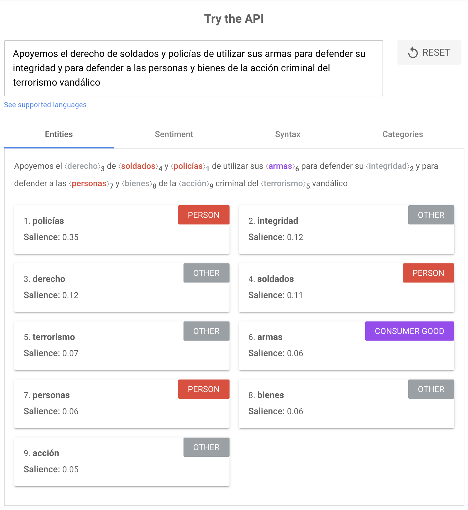
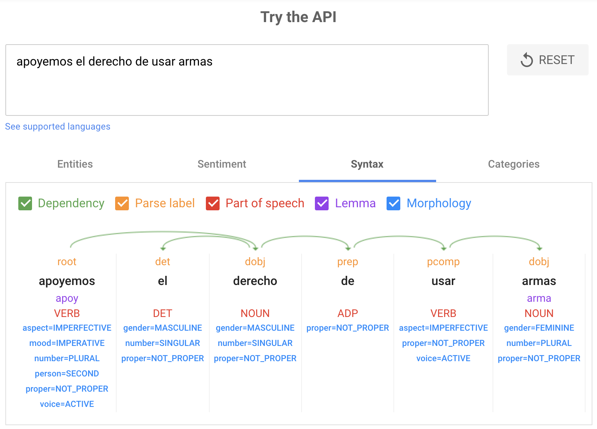
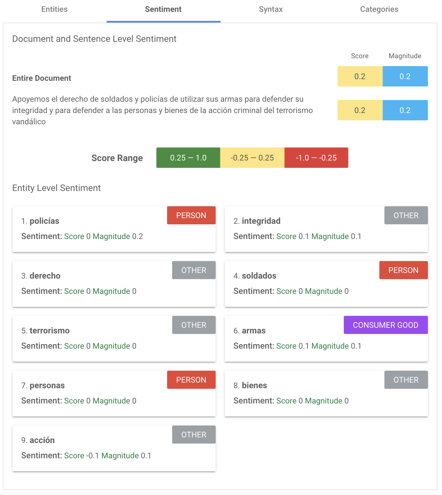
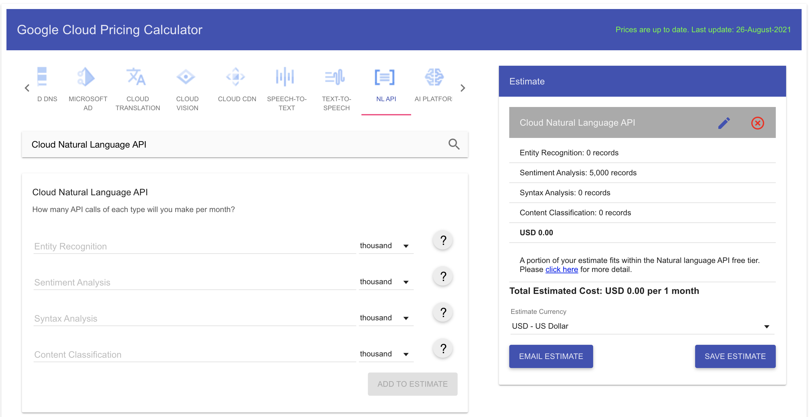

----------------

**Universidad Internacional de La Rioja**

Facultad de Ciencias Sociales y Humanidades

**Máster Universitario en Humanidades Digitales**

Análisis de la semántica del odio en twitter de políticos representativos afines al partido de gobierno en el marco del paro nacional 2021

|Trabajo fin de estudio presentado por:|Arturo Crespo|
|---------|---------|
|Tipo de trabajo:|Investigación|
|Director/a:|Dr. JOSE LUIS LOSADA PALENZUELA|
|Fecha:|Septiembre 2021|

-----------------

## Resumen

Aqui va el resumen

**Palabras clave:** Twitter, NLP, Análisis de sentimientos

## Abstract

Aquí va el resumen en esperanto

**Keywords:** Twitter, NLP, Opinion minning

## Índice de contenidos


## Indice de figuras

Figura 1

Figura 2

Figura 3


## Índice de tablas

Tabla 1

## Preliminares

Dedicado a todos manifestantes, a los que perdieron sus ojos y a los que cayeron mientras alzaban su voz por una Colombia mas justa
<!-- Es un apartado optativo que tienen la función de personalizar el TFE si se considera
conveniente. Es un espacio reservado para dedicatorias, agradecimientos
institucionales, etc. -->

## 1. Introducción

> [!IMPORTANT]
> "Creo que el odio es un sentimiento que sólo puede existir en ausencia de toda inteligencia" decía Tennessee Williams.

Dentro de las emociones, el odio es algo que podemos percibir con a simple vista, ya sea por el vocabulario, la sintaxis usada o simplemente su intensidad que brota de manera imperativa. Dentro de las personas que se inmiscuyen en el ejercicio de la política, el discurso es la herramienta con la que llegan a sus electores y es el momento en donde podemos ver cómo sus emociones se ven reflejadas en su relación con la gente y la democracia.

Para un político lograr llegar a más personas es fundamental, ya que debe mantener la visibilidad de su trabajo político. En algunos casos vemos cómo algunos políticos aplican en sus discursos un lenguaje que no tiene nada que ver con el ejercicio de la política, sino que pretenden conglomerar a su electorado en emociones más que en ideas fundamentadas. Ahora bien, estos discursos ya no se presentan en momentos especiales o en plazas públicas con multitudes de seguidores esperando que el personaje político les de un mensaje profundo que los represente, hoy día los discursos se han reducido a una comunicación de unos cuantos caracteres en fragmentos que condensan las ideas de su ejercicio político y representativo.

Es así como en el marco del paro nacional 2021 en Colombia podemos ver como los diversos actores políticos han puesto en manifiesto sus posturas a favor o en contra de las peticiones que los ciudadanos en las calles se han volcado a exigir, entre ellas la dignificación del ser humano.... y es en los medios sociales los que los actores políticos han manifestado sus posturas. Si bien el derecho a la libre expresión es un derecho fundamental, podemos reconocer que en las palabras que algunos de estos actores publican, no hay un discurso conciliador y de diálogo sobre las peticiones de los manifestantes, sino que es un discurso de contención y represión con un lenguaje que produce emociones mayormente negativas en sus lectores.

En ese orden de ideas, este estudio pretende detectar e identificar cuales son los tipos de emociones que estos personajes públicos de la política nacional colombiana generan con sus publicaciones en redes sociales en los tiempos del paro nacional que inició el 28 de abril de 2021, Es la intención de este estudio corroborar a través de los algoritmos del procesamiento del lenguaje natural por su sigla en inglés NLP que los discursos de los personajes más relevantes de la política colombiana se pueden vincular con intenciones positivas, negativas o neutrales, de las cuales las opiniones negativas.

Este estudio hace uso de las herramientas tecnológicas de más alto nivel como lo son el algoritmo de NPL de Google llamado BERT, el cual ha sido entrenado con el paso de los años para detectar la semántica usada por los usuarios en el lenguaje y uso que dan en libros, la web, el buscador Google, entre otros. Así, el algoritmo nos ayudará a ver un poco más allá en la intención de lo que los políticos manifiestan en sus redes sociales. Este estudia también hará uso de herramientas de scrapeo de redes sociales, específicamente Twitter como un dataset de análisis básico en el marco de tiempo contemplado desde el 1 de abril de 2021 hasta el 30 de julio de 2021, más allá de lo que puedan publicar en otras redes y otros momentos de su carrera política.

Los aportes teóricos que fundamentan este estudio serán basados en las invesnigaciones periodisticas de algunos de los medios de comunicacion mas importantes de Colombia, las investigaciones academicas de las universidades XXXXX sobre procesamiento del lenguaje natural, las nociones de odio de la RAE y las que se relacionan en el libro Contra el Odio de XXXX que  seran expuestos con mayor profundidad en el primer apartado. En el segundo apartado serán abordadas las cuestiones técnicas de NLP y de la extraccion del dataset desde Twitter. Finalmente, se aplicará bajo esta metodología de todo ese andamiaje técnico y teórico construido en el último apartado para analizar y explicar los resultados de las solicitudes de análisis de los tweets del Google Natural Language AI teniendo en cuenta las nociones de emoción positiva y negativa.

<!-- Objetivo es ver cual es el discurso de oído en twitter, utilizando NLP y Google  -->

## 2. Capítulo I

### 2.1 Contexto de la situación política en Colombia en 2021

Desde el desarrollo de las tecnologías de la información y la masificación de las redes sociales, en Colombia y en el mundo se han dado cambios significativos en la manera en que nos comunicamos, las redes sociales se han convertido en medios de comunicación y difusión más efectivos a la hora de llegar a la mente de los usuarios finales, en otras palabras, las redes sociales ya no solo informan sino que también mueven emociones.

En Colombia existe un 119% de teléfonos conectados a internet en proporción a los más de 60 millones de dispositivos en una población de 50 millones de habitantes. En cuanto a las redes sociales se calcula que existen 35 millones de usuarios activos mensualmente, cifra que equivale al 69% de la población del país. Estas cifras son las que dan cuenta del potencial difusor y la importancia de desarrollar todo un sistema discursivo en este entorno si se es una figura pública o personaje político que busca reconocimiento y aprobación. [@usotic2021]

<!-- hablar sobre las razones y los manifestantes -->

Los personajes de la política nacional colombiana son conscientes de estas herramientas de difusión masiva, es así como una vez conocido su potencial, han pasado a hacer de estas su arma más útil a la hora de mover a sus seguidores, y me refiero a seguidores porque en sus cuentas, en algunos casos, cuentan con más personas siguiendo sus discursos, que personas que realmente votan por ellos en los días de sufragio electoral. [@luisRuano2018]

<!-- Incluir ejemplos -->

En 2016 fuimos testigos de cómo se implementó toda una campaña en redes sociales por los promotores del NO en el plebiscito de la paz. En palabras textuales "Estábamos buscando que la gente saliera a votar verraca", dijo Juan Carlos Vélez. [@elpaisplebiscito2016] En 2018 pudimos ver cómo se usaron las mismas técnicas, allí se acuñó el término "castro-chavismo" para llevar a las personas a no debatir las ideas sino las emociones que generaba la posibilidad de entrar en una crisis económica como la que atraviesa Venezuela. 

Ya hoy en 2021 aunque las redes sociales han regulado más la difusión de información falsa [@forbesfake2021] Pero las estrategias mediáticas de los políticos ahora están enfocadas en mover emociones con información que no es falsa pero que trata de llegar más a las emociones que de llevar a un proceso reflexivo sobre los asuntos clave de la política nacional.

Es por ello que se ha considerado pertinente analizar el periodo que transcurre entre el 28 de abril de 2021, día en que inicia el paro nacional de ese año, y día en el que se despliega toda una campaña de estigmatización de la protesta social. Aquí veremos cómo las personas que salen a la calle a exigir sus derechos son llamados vándalos, terroristas, o simplemente estigmatizados por su condición social.

En este punto también es importante dar cuenta de cuáles son los políticos colombianos que cuentan con un mayor alcance en redes sociales y por ende mayor difusión discursiva. Es así como se tendrá en cuenta la cantidad de seguidores y su relevancia en la toma de decisiones o influencia en la rama ejecutiva de la nación.

Los personajes escogidos para este análisis se han seleccionaran debido a su alcance y nivel de importancia por representatividad política. No se tienen en cuenta personajes que son públicos pero no tienen ningún tipo de poder político durante el periodo escogido.


<!-- Todo esto ha surgido porque la mayoría de la gente también está preocupada por el deterioro de los derechos humanos en Colombia y en los países vecinos. Por ejemplo, en Colombia el gobierno ha empezado recientemente a utilizar la tortura para sacar información a los manifestantes. Lo que está ocurriendo en Colombia y las naciones latinoamericanas da mucho miedo. -->


.........

### 2.2 ¿Que es un discurso del odio?

El presente apartado expondrá las principales herramientas teóricas que guían la forma como se aborda la pregunta sobre la semántica del odio. Empecemos por definir todo lo que se tomará como semántica y su uso en este estudio.

Se entiende que la semántica es la rama de la lingüística que se encarga de estudiar el significado que se le atribuye a un conjunto de expresiones, ya sea escritas o habladas. Por otro lado se hará uso de la definición tácita que la RAE hace sobre el significado de Odio,

Odio: Del lat. odium. 1. m. Antipatía y aversión hacia algo o hacia alguien cuyo mal se desea. [@RAEOdio]

Podemos ver entonces que lo que llamaremos discurso de odio, no es más que un conjunto de oraciones sintácticamente organizadas con la intención de manifestar aversión por ideas de las cuales no se consigue empatía, ya que hay un sentimiento de desafecto que predomina y se traspasa o lo discursivo.

[@florplaza2020]
[@laurabustos2019]
[@manuelaguilar2019]
[@lucianadabiau2013]
[@jhonroberto2020]


> [!IMPORTANT]
> "Basta con que un hombre odie a otro para que el odio vaya corriendo hasta la humanidad entera." Jean Paul Sartre


### 2.3 Incitación al odio en redes sociales

---

En primer lugar, preguntémonos ¿Qué es la incitación al odio, si no es un intento de afectar física o de manera psicológica a alguien? Todo el mundo tiene su opinión sobre lo que es el discurso del odio y todo el mundo siente la necesidad de expresar la suya.

No hay nada malo en estar orgulloso de la herencia o de su país. Está bien tener una opinión, incluso si no se está de acuerdo. Lo que está mal es cuando se utilizan esas opiniones de forma malintencionada para perjudicar o influir en la mente de los demás. En otras palabras, si se promueve públicamente, en este caso en redes sociales, el odio y la intolerancia hacia los que difieren del pensamiento de otro, se está casi cometiendo un daño contra la humanidad, ya que no sólo se está estigmatizando a los individuos a los que se odia, sino que también se esta obstaculizando el proceso de conocimiento de la mente de las personas que intentan llegar a la comprensión de los asuntos y problemas del entorno común.

De hecho, las principales plataformas de redes sociales como, facebook o twitter, están prohibiendo el uso de sus servicios a las personas que realizan este tipo de actividades. No se trata de filiación política, religión, raza, etc... Se trata de la capacidad de una persona para tener empatía y ponerse en la posición de otras personas. En una sociedad libre y abierta, debería ser aceptable que todos los ciudadanos expresen sus opiniones y compartan información sobre ellas. Desgraciadamente, la mayoría de los ciudadanos no son conscientes de que están actuando de una manera que no les está legalmente permitida.

Algunas personas creen que pueden decir lo que quieran en Internet, por lo que expresan sus opiniones sin filtro en redes sociales y medios de comunicación online. Los que participan en estas actividades anuncian continuamente un discurso de odio contra los que no están de acuerdo con ellos. Y lo que es peor, algunos de estos usuarios participan constantemente en actividades diseñadas para acosar a otros miembros de grupos minoritarios en línea, como ya ha sido visto en algunos casos en Colombia, donde los políticos se coordinan para posicionar ideas o atacar a sus contradictores en redes sociales. [@cerosetentabodega2020]

Por esa razón, es importante que cada persona sea muy consciente cuando utilice las redes sociales de que la información que está consumiendo tiene algunas intenciones más allá de informar u opinar. Hay ciertas frases o palabras que pueden desencadenar toda una serie de sucesos que incitan la polarización y la violencia en sus espectadores.

“El odio solo se combate rechazando su invitación al contagio. Es necesario activar lo que escapa a quienes odian: la observación atenta, la diferenciación constante y el cuestionamiento de uno mismo.» [@CarolinEmcke2017]

Otro problema que deriva toda esta práctica sistemática, tiene que ver con la estigmatización del contradictor. En algunos casos hemos visto cómo personas han sido señaladas como objetivos militares, solo por el hecho de controvertir las ideas de algunos políticos relevantes en el contexto nacional. [@flip2017]

¿Qué es la incitación al odio en las redes sociales? Las plataformas de las redes sociales son la clave de lo que es la incitación al odio, por desgracia. Y aunque hay muchas formas positivas en las que Internet puede ayudarnos a comunicarnos con los demás, el problema reside en aquellos que deciden utilizarlo para difundir su odio. Es necesario hoy dia ser cuidadoso al momento de ser un activista en linea ya que las consecuencias pueden ser mortales. [@alejandroperez2020]

---

Muchos estudios han ahondado mucho más en la definición de esta cuestión, pero en este caso nos centraremos en la definición ya expuesta, para detectar en los mensajes discursivos de los personajes representativos de la política colombiana generan de manera visceral en sus redes sociales. [@Lukaskunc2020]

Veamos algunos ejemplos de oraciones sintácticamente correctas que al parecer contienen un mensaje que manifiesta la antipatía de un grupo poblacional a otro.

En el marco del para nacional en Colombia en 2021 el expresidente, expresidiario e investigado por la desaparición de 6402 personas en su mandato AUV escribió esto en su cuenta de Twitter.

“Apoyemos el derecho de soldados y policías de utilizar sus armas para defender su integridad y para defender a las personas y bienes de la acción criminal del terrorismo vandálico” [@elpaisprotestas2021]

A simple vista, podemos ver que no se usan palabras que tengan referencia a la conciliación, más bien hacia el uso de la fuerza sin mediación. También podemos observar como se pone en bandos a las personas de las cuales se hace referencia, por un lado a las fuerzas armadas y por otro a los manifestantes. Los que hacen una de las ramas son tratados como defensores y los manifestantes tratados como criminales terroristas y vándalos.

En este caso podríamos determinar que el discurso del odio es tácito, pero más adelante vamos a pedirle a los algoritmos de NLP que analicen este texto y nos digan si la conclusión apriori es verdadera, falsa o en qué medida podemos encontrar este tipo de valores.

Hay que aclarar que este estudio no ahondará en temas relacionados con la libre expresión, ya que sale del marco del marco de investigación el cual solo se propone establecer el valor del discurso con valores en magnitudes de escala numérica y de acuerdo a la puntuación serán positivos, neutros o negativos de los discursos seleccionados.

<!-- Wiki: La semántica es el estudio del significado atribuible a expresiones sintácticamente bien formadas

Estos discursos pueden difundirse de forma oral, escrita, audiovisual, en los medios de comunicación o en internet y buscan apelar a la emoción más que a la razón y resaltar cierta actitud de dominio de uno sobre otro y de esta forma silenciar a determinados grupos sociales. Bustos Martínez, L. et al. (2019). “Discursos de odio: una epidemia que se propaga en la red. Estado de la cuestión sobre el racismo y la xenofobia en las redes sociales”, en Mediaciones Sociales 19, 25-42. https://revistas.ucm.es/index.php/MESO/article/download/64527/4564456551208 -->


---

## 3. Capítulo II

<!-- Herramientas utilizadas -->

### 3.1 ¿Qué es el Procesamiento del Lenguaje Natural (NLP)?

El procesamiento del lenguaje natural con las siglas NLP del inglés Natural Language Processing, es un campo de las ciencias de la computación, de la inteligencia artificial y de la lingüística, que estudia las interacciones entre las computadoras y el lenguaje humano. El NLP tiene como objetivo hacer que los ordenadores entiendan o interpreten el lenguaje natural para que puedan realizar diversas actividades similares a las humanas, como la traducción de voz o incluso responder a preguntas sencillas como "¿Cómo está el clima en Bogotá?". El NLP se ocupa de cómo las máquinas entienden el mundo y el lenguaje de los seres humanos y lo que les rodea. En este apartado se profundizará en los conceptos y pasos básicos para que este proceso sea uno de los más avanzados en las tecnologías de la información contemporáneas.[@pablogamallo2012]

[@lagocollarte2020]

<!-- Los modelos lingüísticos, o estructuras lingüísticas, son el medio por el que los programadores y usuarios de NLP y programas similares se comunican entre sí. Los modelos pueden utilizarse para crear algoritmos de aprendizaje tanto descriptivos como predictivos. -->

### ¿Cómo funciona el NLP?

<!-- El procesamiento natural del lenguaje toma la actividad digital y lo contrasta con el corpus: compendios de cómo nos expresamos y hablamos: contexto.

El NLP es cercano a nuestra manera de procesar el lenguaje. Obvio hay inconsistencias, pero se acerca mucho a la realidad-->

Para lograr que un sistema logre procesar el lenguaje humano es necesario que el sistema aprenda las reglas del uso de nuestra manera de comunicarnos.

- La morfología se ocupa de la composición de las palabras y de sus relaciones con otras palabras.
- La sintaxis define el modo en que las palabras se unen para formar frases.
- La semántica hace referencia tanto al significado de las palabras como al de los grupos de palabras.
- La pragmática se hace eco del contexto en el que se llevan a cabo las locuciones lingüísticas.
- La fonología se ocupa de la estructura fonética del lenguaje hablado y es importante para el reconocimiento de la voz.

Básicamente se programa un algoritmo para que lea cada frase de un texto. El programador aplica una regla gramatical y el algoritmo cambia cada palabra por un Token, este Token representa el significado de la palabra y también cualquier relación gramatical asociada. Cada vez que se utiliza una palabra clave, el programa busca en la base de datos el mismo token, y si encuentra el mismo token, no traduce la palabra, sino que busca de nuevo hasta encontrar una coincidencia.

Después, se vuelven a buscar en los tokens las palabras que se han omitido durante el análisis. También se buscan los significados que coinciden con los tokens. Si este procedimiento de concordancia tiene éxito, el resultado es una sola palabra que contiene todos los tokens requeridos. El software almacena esta palabra en la memoria y realiza las siguientes búsquedas utilizando esta palabra almacenada. El Procesamiento del Lenguaje Natural no es más que un conjunto de algoritmos que permiten a un ordenador reconocer patrones en datos de texto.

La técnica de tokenización es implementada por un programador que decide un formato de frase y luego implementa una técnica de tokenización que produce los tokens adecuados. A continuación, los tokens se concatenan para formar una única entidad. El Procesamiento del Lenguaje Natural utiliza un vocabulario muy amplio que se organiza cuidadosamente en un marco, que consiste en una gramática de construcción de frases y una técnica de tokenización. Con la ayuda de un tokenizador, podemos transformar grandes cantidades de datos de texto no organizados en una forma significativa. El tokenizador de palabras es una parte muy importante de la NLP ya que es la manera en que se estructura un texto de manera numérica y matemática que generan una matriz. [@pablogamallo2012]

<!-- El proceso de NLP "congela" estos elementos léxicos para que podamos analizar una frase determinada como una unidad. Por ejemplo, la palabra "dog" en inglés puede significar varias cosas, dependiendo de si va antes de "the", "at", "in" o "down". En alemán, sin embargo, la palabra "dog" sólo significa "un perro propiedad de alguien"; "un perro en Alemania" sería inaceptable. Necesitamos un sistema de tokenización especial para lenguas como el alemán. Por eso tenemos la omnipresente "zu-frase" en inglés, una contracción de "zu-verb". -->

Un tokenizador de expresiones regulares es una herramienta de NLP que extrae información de una frase, identificando las partes de la oración asociadas a tokens específicos. El tokenizador de expresiones regulares extrae palabras de una cadena de textos y frases, encadenadas en varios contextos. Podemos pensar en cada token como una expresión regular: un conjunto de posibles tokens asociados a un contexto concreto. Algunos expertos del NLP hablan que uno de los objetivos de la lingüística moderna es comprender todas las estructuras de expresiones regulares de que disponemos, ya que nos permitirá "crear un lenguaje que no está sujeto a reglas gramaticales".

Por supuesto, muchos expertos no están de acuerdo con esta afirmación. Pero mantengamos las cosas sencillas por el bien del argumento. La expresión regular y la tokenización de palabras son sólo dos de los muchos métodos diferentes que utilizan los lingüistas para analizar la estructura de las frases de un documento. Estos diferentes métodos se combinan con matrices que muestran las probabilidades de los diferentes tipos de tokenización.

Los procesos de NLP que hacen uso del machine learning, básicamente usan dos tipos de entrenamientos, de aprendizaje supervisado y no supervisado. El aprendizaje supervisado implica un modelo único que recibe entradas, como un anuncio, y produce una reacción de valor en base a ese entrenamiento. Esta respuesta puede ser una etiqueta, una respuesta basada en reglas o una combinación de ambas. El aprendizaje no supervisado no requiere modelos de aprendizaje supervisado; en su lugar, utiliza una serie de procesos basados en reglas y características que realizan análisis de sentimientos en el lenguaje natural.

Cuando se utilizan herramientas de NLP para el análisis de medios sociales, es importante recordar que estas herramientas están diseñadas para apoyar determinadas funciones empresariales. En particular, un analista de NLP tendría que entender cómo preparar adecuadamente una linea de análisis utilizando las herramientas disponibles para NLP, y luego utilizar eficazmente la información obtenida para apoyar las decisiones de negocio. Los pasos para lograr este objetivo incluyen el entrenamiento de la red sobre cómo identificar palabras y frases clave, así como el significado asociado en relación con los datos proporcionados a través del material de origen. Esto lo veremos en detalle en el siguiente apartado.

### Usos del NLP

Entre los usos más comunes del NLP encontramos:

- Análisis de sentimientos de clientes
- Análisis de documentos empresariales
- Clasificación de contenido
- Análisis de tendencias
- Análisis de documentación médica

<!-- ¿Cómo se puede extraer de ahí el lenguaje del odio? -->

<!-- visión general - nlp - minería - tecnologías, elijo una tecnología, pq una y no otra, permite al investigador análisis sencillos. que es nlp que es el análisis de sentimientos y porque se elige, luego explicar API de Google, -->

En el análisis de sentimientos, un algoritmo de NLP analiza en base a unos modelos potentes y previamente entrenados atraves de redes neuronales y de aprendizaje profundo en los que ya se han analizado las tendencias entre positivo y negativo, pero esto no quiere decir que lo negativo sea equivalente a discurso de odio o la intención con la que se esta difundiendo, lo que si podemos determinar es el tipo de sentimiento y la intensidad de la emoción que se esta expresando.

En este estudio profundizaremos mas, en el uso del NLP para el análisis de sentimientos con preentrenamientos que Google ha construido en base a su infraestructura como buscador, analisis tendencias, analisis de sintaxis, analisis semantico, entre otros.

En el mundo empresarial, el análisis de sentimientos es una forma de obtener una visión más rica de las motivaciones de los clientes. A las empresas les interesa identificar la diferencia entre las emociones positivas y negativas que conducen a la satisfacción del cliente. Otra aplicación del análisis de sentimientos es la identificación de la fidelidad de los clientes. Se utiliza para determinar si las palabras o frases positivas o negativas conducen a una mayor fidelidad.

[@josemartinez2017]

El análisis de sentimientos es una de las tecnologías mas prometedoras para el mundo empresarial y de las comunicaciones. Las empresas de computación en la nube y de redes sociales, están creando potentes plataformas de análisis que les permita entender a sus clientes e involucrarlos en una conversación atractiva. Para conseguirlo, los responsables de marketing no tienen que recurrir a los canales de publicidad tradicionales, sino que pueden "comprar" una audiencia específica a través de la participación en los medios sociales. De este modo, no necesitan gastar fondos adicionales en campañas de pago, sino que simplemente pueden animar a los consumidores a expresar sus opiniones a través de las redes sociales. Las empresas también pueden aprovechar este mercado utilizando estos programas para analizar y descifrar el sentimiento de los consumidores sobre sus productos o servicios. Mediante el uso de herramientas y tecnologías de código abierto, estos investigadores son capaces de aprovechar una gran experiencia y conocimiento sobre cómo analizar e interpretar con éxito las respuestas de sus consumidores.

Otra forma en que las empresas pueden aprovechar estas herramientas para NLP, es en el poder del léxico de sentimientos y otros aspectos de la cadena de procesamiento del lenguaje natural. En el pasado, a los profesionales del marketing les resultaba difícil discernir el sentimiento de los clientes a partir de los datos generales de navegación por Internet. Sin embargo, los avances en la tecnología de NLP permiten ahora a los profesionales del marketing entrenar previamente un léxico de sentimientos para capturar el lenguaje utilizado en las conversaciones en línea. Esto se hace mediante un proceso denominado extracción, que consiste en identificar las fuentes de información textual existentes sobre el producto y el servicio en cuestión, se pueda recopilar información adicional de los sitios web asociados. Una vez que el léxico se ha entrenado adecuadamente, puede aprovecharse para proporcionar a los profesionales del marketing información en tiempo real sobre los pensamientos y sentimientos reales de sus consumidores.

Los profesionales del marketing llevan tiempo utilizando herramientas de NLP, pero no ha sido hasta hace poco que han aprovechado el potencial de los tweets para ofrecer información sobre el comportamiento de los consumidores. Twitter, la mayor plataforma de medios sociales actualmente en funcionamiento, ofrece a los profesionales del marketing una oportunidad única para obtener información rápida y valiosa sobre las numerosas preguntas que se hacen los compradores al adquirir productos. Al utilizar Twitter, los profesionales del marketing pueden utilizar la etiqueta #hashtag para extraer términos clave y palabras clave relacionadas con el artículo en cuestión. Por ejemplo, si un consumidor busca un par de zapatos en Twitter, la etiqueta #Los zapatos se convierten en un excelente recurso para saber más sobre la persona que busca, como por ejemplo qué tipo de zapatos está buscando. Tras encontrar las palabras clave adecuadas, los tweets pueden segmentarse para obtener aún más información sobre lo que buscan los consumidores.

Los responsables de marketing no pueden pasar por alto el poder de la NLP y las diversas aplicaciones que la componen. Aunque al principio pueda parecer algo abstracto, aprovechar el poder de la NLP y sus algoritmos afines proporcionará grandes beneficios de marketing a largo plazo. Al comprender las dos caras de la moneda, los profesionales del marketing pueden controlar mejor su imagen de marca y aprovechar al máximo su potencial como punto de venta. Sin embargo, hay que tener en cuenta que muchas grandes marcas ya hacen uso de la tecnología de NLP y de aprendizaje profundo para comprender mejor y dirigirse a su público. Por ejemplo, hace tiempo que se rumorea que Google está trabajando en su propia versión de NLP. La conclusión es que el uso de herramientas de NLP y aprendizaje profundo probablemente se hará cada vez más popular en el futuro, lo que permitirá a los vendedores y a las empresas aprovechar los beneficios de la utilización de esta tecnología sin obstaculizar su eficacia.

### 3.2 Como funciona Google NLP

Esta investigación hace uso del servicio de Google Natural Language AI en el que se encuentra el . Las técnicas de NLP de Google han avanzado con el paso del tiempo, pero hoy dia uno de las investigaciones de las que están mas orgullosos es BERT, que por su acrónimo en ingles Bidirectional Encoder Representation from Transformers traduce Representaciones de Codificador Bidireccional de Transformadores. [@googleBERT]

Basicamente BERT funciona de acuerdo a su acronimo:

**Bidireccional** porque analiza el texto en ambas direcciones, tanto de derecha a izquierda y viceversa, así como por partes de la oración. Así se garantiza que el análisis de la oración envuelva un sentido gramatical dependiendo del contexto en el que está escrita.

Los **transformadores** Son modelos de aprendizaje automático que prestan atención a que el texto de entrada tenga coherencia, sus conectores sean adecuados y el sentido después de contrastar con múltiples sinónimos y adjetivos, todo esté relacionado con una pasible respuesta al texto de entrada y tenga coherencia como texto de salida. Esto garantiza que el análisis del texto tenga relación desde su origen hasta el resultado expuesto, con eso se soluciona que los análisis de texto se den en un sentido en la entrada y su resultado sea otro sentido totalmente distinto en la salida.

Si vemos la frase "tengo que ir al banco porque estoy muy cansado" el algoritmo debe ser capaz de reconocer que en la sintaxis y la gramática de la oración, no estamos haciendo referencia a la oficina bancaria sino a la silla del parque en la que uno se puede sentar. Esto es posible gracias a la comprensión pre entrenada con la que el algoritmo de BERT ya ha entendido que el banco del parque y el cansancio son palabras que están muy próximas por su relación gramatical, conectores y otro tipo de test que relacionan una posible respuesta que tiene sentido con la oración de entrada.

En los casos que algunas de las palabras del texto tengan varias acepciones como en el caso de "banco", el algoritmo asigna un puntaje a esa palabra, ese puntaje se asigna de acuerdo a su posición dentro de toda la oración, ya sea que el transformador la este interpretando de izquierda a derecha o viceversa en relación con otra palabra y/o con la palabra siguiente.

### Análisis de sentimientos

El análisis de sentimientos es un subcampo del procesamiento del lenguaje natural que se encarga de clasificar los tipos de mensajes que se encuentran en la semántica del mensaje de las oraciones que se quieren analizar. [@wikisent]

La tambien llamada minería de opinión es una técnica innovadora de analisis de textos que aplica el procesamiento del lenguaje natural y la lingüística computacional para identificar y extraer automáticamente los sentimientos u opiniones positivas, negativas y neutras de un texto en una escala determinada, generalmente de 0 a 1, en donde 0 o menos es un sentimiento claramente negativo y 1 o mas es claramente positivo. <!-- Tipo de emoción en NLP -->

Esto permite permite por ejemplo a empresas de comercio electrónico acceder a la mente de sus clientes y averiguar lo que prefieren y lo que no les gusta, incluyendo todos los tiempos verbales, para poder crear servicios y productos que satisfagan plenamente sus necesidades. Esencialmente, le ayuda a entender lo que impulsa las emociones de sus clientes y sus decisiones. Si una empresa establece mejores relaciones con sus clientes, podrá crear una base de clientes más sólida y productos con mayor nivel de satisfacción en el consumo.

¿Por qué la extracción de opiniones es una parte importante de la NLP? Es importante para la NLP porque permite a los investigadores estudiar el proceso de toma de decisiones del ser humano, incluyendo tipos de patrones que son recurrentes en la actividad digital, qué nos hace enfadar, entristecer, alegrar o motivar. Esto, a su vez, crea mejores oportunidades para que todo el mundo -comerciantes, clientes y otras empresas- se involucran en interacciones más significativas. En resumen, nos ayuda a pensar fuera de unos marcos establecidos cuando se toman importantes decisiones.

El análisis de sentimientos es el proceso de revisar las declaraciones escritas de un cliente y determinar qué declaraciones reflejan los verdaderos sentimientos del cliente. En resumen, el análisis de sentimientos consiste en analizar lo que la gente dice, cómo lo dice y cómo se reflejan esos sentimientos por escrito. A veces el objetivo es descubrir una verdad oculta. Por ejemplo, si un cliente se queja de su jefe, un profesional de la NLP en tiempo real podría revisar los correos electrónicos y las notas del cliente sobre el jefe y observar indicios sutiles sobre problemas emocionales que el jefe puede estar tratando de ocultar.

Este tipo de análisis funciona de manera condensada de la siguiente forma:

<!-- Análisis de dependencias, análisis morfológico,  análisis de entidades, lematización. -->

Paso 1. Se divide el texto en fragmentos básicos llamados tokens, los tokens pueden ser palabras, caracteres o signos de puntuación. En este punto es importante resaltar que a este proceso que se le llama tokenización, de base tiene 3 tipos: tokenización delimitada por espacios entre palabras, tokenización delimitada por caracteres para evaluar la raíz de la palabra y tokenización delimitada por signos de puntuación o etiquetas.



Paso 2. De manera posterior se contrastan esos tokens con corpus lingüísticos, ya sean especializados o generales, para identificar la relación de los tokens con sentidos en los cuales puedan estar relacionados con temas específicos de uno u otro corpus lingüístico.

Si volvemos a nuestro primer tweet que se ha hecho referencia, una tokenización extraída del sitio web de Google NLP nos muestra la relación que tiene cada una de las palabras con temas específicos.



Paso 3. se le asignan puntajes a las palabras en relación



### 3.3 Extracción de datos para análisis en Twitter

Existen muchas maneras de extraer datos para el análisis con algoritmos, pero en este caso nuestra sección de datos serán los mensajes cortos o tweets que los personajes de nuestro análisis han dejado como registro de sus discursos en el periodo de las protestas 2021.

En primer lugar, si no se tiene mayor conocimiento de cómo extraer datos, se pueden extraer de manera manual, en un ejercicio de copiar uno a uno de cada enlace del tweet que inicia en la fecha indicada, hasta el tweet de la fecha final. Pero este es un proceso casi artesanal y en el que el tiempo es un factor importante, ya que toma mucho tiempo debido al volumen de información de cada uno de los personajes. En algunos casos estos personajes pueden twittear hasta 30 veces al día, esto hace que la tarea sea posible pero dispendiosa.

En segundo lugar, los datos se pueden extraer con las herramientas que la misma red social nos da. Para ello Twitter en su versión para desarrolladores proporciona el acceso a su interfaz de programación de aplicaciones o API por sus siglas en inglés. Con estas reglas y claves de acceso, podemos solicitar de la base de datos la información que se requiere para este análisis. Pero recientemente Twitter ha actualizado el acceso a sus datos, esto debido a la protección de datos personales y estrategias comerciales que permitan que su modelo de negocio sea rentable, de acuerdo a la credibilidad en el producto por parte de los usuarios que hacen uso de su plataforma.

Otra manera de extraer los datos, se hace posible con una técnica llamada "data scraping o scrapeo". El scrapeo funciona de la siguiente manera:

1. Se programa un algoritmo que vaya donde está los datos se quiere extraer.
2. Se establecen los parámetros de cual es la información que debe extraer.
3. Se fijan las características para almacenar la información y presentación al usuario final.

Esto se puede realizar con lenguajes de programación como Python, Javascript, Go, entre otros, pero como una de las intenciones de esta investigación es que las personas que la lean sean capaces de replicar fácilmente este ejercicio, se hará uso de métodos llamados "no code" para lograr los mismos resultados sin tener mayores conocimientos en lenguajes de programación.

En este caso, se hará uso de la herramienta Phantombuster, la cual se especializa en este tipo de programaciones, poniendo al usuario final una interfaz amigable para el proceso y finalmente tener un dataset en forma de tabla, en un archivo .csv que nos permitirá hacer el proceso de análisis con el algoritmo de NLP de Google.

## 4. Capítulo III

### 4.1 Seleccion de personajes y análisis de sus discursos

Ahora que conocemos el contexto político, las bases teóricas de lo que conocemos como odio, cómo funciona el NLP, cómo funciona el análisis de sentimientos y cuales son las técnicas para extraer datos de twitter. Ahora sí procederemos a aplicar todo esto en un proceso de extracción y análisis de los tweets que se encuentran en las cuentas de las cuentas que nos proporcione la herramienta XXXXXXX para determinar cual es tipo de sentimientos en el uso de lenguaje que exponen en sus publicaciones y cual es la tendencia de estos sentimientos, siendo estos positivos, neutrales o negativos. De esta forma nos acercaremos más a una conclusión sobre las posibles intenciones discursivas con el uso que hacen del lenguaje.

- Primero determinaremos cuales son los personajes más relevantes de acuerdo a su nivel de alcance en twitter y su ejercicio en un cargo de la política nacional colombiana.
- En segundo lugar se construirá un dataset con los tweets de cada uno de los personajes, en el rango de tiempo en el cual hemos determinado que se desarrolló el paro nacional 2021.
- Tercero, construiremos un notebook de Python para ejecutar las llamadas a la API de análisis del lenguaje natural de Google.
- Cuarto, se construirán gráficas que permitan visualizar los datos de manera más amigable.
- Quinto, se procederá a realizar la ejecución del laboratorio y se observan los resultados para su posterior análisis.

Se ha usado para medir sus niveles de alcance la herramienta **XXXXXXXXXX** con lo cual dejaremos que los números que ellos mismos alcanzan, sean el método de selección para este análisis.

El primer personaje en nuestro análisis será AUV con más de 4.5 millones de seguidores en Twitter y que cuenta con niveles de replicación importantes dentro de su partido y sus seguidores, al momento de realizar publicaciones en su perfil. twitter de AUV

El segundo personaje que tiene importancia dentro de este análisis es el presidente de la república de Colombia IDM. el cual cuenta con más de 2 millones de seguidores. Su relevancia está dada más por su posición política representativa que por los niveles de credibilidad y favorabilidad dentro de la población. Ya que tiene a disposición los canales de comunicación oficiales estatales. Twitter de IDM

Nuestro tercer personaje con el cual haremos un análisis será el senador ....

Todos estos personajes hacen uso de las redes sociales como una plataforma discursiva donde exteriorizan sus emociones y divulgan sus afinidades ideológicas.

Finalmente podemos realizar el analisis de cada uno de los datasets que hemos extraido, en la seccion de anexos se realizara paso a paso todo el procedimiento, tambien se podra encontrar este laboratorio listo para su ejecucion en Google Collab y en Github y Zenodo para su réplica y mejora por otros investigadores con más experiencia tecnica. Se puede acceder a ellos a través de los siguientes enlace: [https://github.com/arthurocrates/analisis-del-discurso-del-odio-en-twitter-de-politicos-con-google-nlp](https://github.com/arthurocrates/)

Link Zenodo

<!-- - Repase bien la documentación, hablar de cómo seleccionó el corpus, la razón, las limitaciones (si la API de Twitter limita a X, usted lo deberá decir, o explicar que, entre otras razones, la forma del corpus se debe a X Y Z)

- cantidad de tuits que quiere analizar, del número de cuentas, quién, etc. Esto le permitirá saber cuáles son los límites del API de Twitter-->

### 4.3 Conclusiones

<!-- Valore qué resultados que espera (según la herramienta que usa) y en qué forma (tabla ya creada, creada por usted, visualización, etc.) para poder interpretarlos.  -->

¿Cómo vas a proceder para comprobar que hay un lenguaje de odio en ese contexto? - nota

la conclusion es...

#### Objetivos cumplidos
#### Trabajo futuro


<!-- Objetivo es ver cual es el discurso de oído en twitter, utilizando NLP y Google  -->

<!-- Sí sirve, si no sirve, si sirve parcialmente y tendría que añadirle tales y tales. -->

## Anexos

Los anexos de codigo se encuentran en un laboratorio en Google Colab para la ejecucion directa sobre la herramienta sin necesidad de instalar software o paquetes adecionales, ademas de un navegador web.

https://colab.research.google.com/drive/1xYhddBu0KH-LnD99fSLjJrsfAgW6QHFl#scrollTo=iBP9LMST6Dxz


<!-- Anexos: estos son apartados opcionales que contienen cuestionarios, encuestas,
resultados de pilotos, documentos adicionales, capturas de pantalla, y otros -->


#### Construcción del dataset para análisis

La extracción y construcción de nuestro dataset lo haremos con la herramientas de automatización web sin codigo como integromat.com, zapier.com o phantombuster.com, estas son plataformas que nos permite extraer información de diversas webs de redes sociales de manera alternativa a las recomendadas por las propias webs de redes sociales. En este caso se debe extraer la información de esta manera, debido a que las restricciones de acceso a la información propias con la API de Twitter restringen el acceso a publicaciones realizadas en un marco de tiempo de 3 meses inmediatamente al día de hoy. Esto restringe el acceso de información a meses o años anteriores al rango del día actual, y aunque esta información sigue siendo pública, dificulta el análisis de periodos específicos requeridos para este análisis.

Para lograr este análisis entonces requerimos los siguientes pasos:

- Vamos a twitter y realizamos una búsqueda avanzada definiendo los parámetros de usuario y rango de tiempo. Y copiamos esa URL.
- Ingresamos a https://phantombuster.com/ y nos registramos.
- Buscamos en el menú el servicio de scraping de Twitter o los "phantoms" de Twitter y buscamos el que indique "Exportar busqueda de Twitter" y lo seleccionamos
- Conectamos nuestra cuenta de Twitter con los pasos guiados de la plataforma.
- En la siguiente pantalla colocamos la URL de la búsqueda en Twitter.
- En la siguiente pantalla definimos cantidad de resultados a scrapear, podemos colocar unos 10000 tweets.
- En la siguiente pantalla seleccionamos que la ejecución del scrapeo se realizará de manera manual.
- En la última pantalla vemos el botón de Lanzar, le damos clic y el scrapeo iniciara.

Al finalizar el proceso la plataforma nos proporciona un archivo results.csv y results.json con todos los tweets que aparecen en esa búsqueda que hicimos en twitter.

#### Limpieza del dataset

El archivo results.csv contiene datos que no son relevantes para hacer el análisis como fecha, usuario, ID del Tweet, link, etc. Entonces tenemos que dejar solo los campos que nos interesan para procesar, que en este caso son es el texto que se publicó como mensaje.

Para lograr unos datos más legibles y efectivos vamos a limpiar el archivo con un editor de hoja de cálculo como Excel. Allí vamos a localizar las filas que contengan datos nulos, que tal vez fue una publicación que era una imagen sin texto o publicaciones que solo contengan un enlace hacia otro sitio.

Aunque el servicio de NLP de Google es capaz de detectar automáticamente estos tipos de datos no relevantes, por un ejercicio de buena práctica, es mejor ayudarle un poco para que los resultados sean mucho más legibles y exactos. El archivo final deberá contener en una fila un tweet con contenido relevante para el análisis.

### Costos de acceso a la API de Google Cloud

Google Natural Language Procesing es un servicio de pago de modelos potentes y previamente entrenados de ML que cuenta con costos por unidades según el volumen de texto a analizar, En su sitio web podemos ver las magnitudes y los precios, los cuales se miden por unidades, euivalentes a: 1 unidad = 1000 caracteres, esto incluyendo espacios en blanco y símbolos especiales. Los precios tienen una recurrencia mensual pero incluyen una capa gratuita de 5000 unidades. Para este análisis solo fue necesario usar la capa gratuita ya que se hizo un uso de XXXX unidades aproximadamente.



#### Creando un Notebook para el análisis de NLP con Google AI

[@servicioIBM]

Como se había comentado antes, este es un proceso que se puede realizar de diversas maneras, desde la programación total de sus componentes hasta el uso de herramientas ya desarrolladas para este fin. Existe gran variedad de empresas que ofrecen el acceso a sus algoritmos de análisis de sentimientos a usuarios finales tales como: IBM, con su algoritmo Watson, Microsoft con sus servicios de Cognitive Services, Google con su servicio de Cloud Natural Language AI, entre otros de empresas, academias e investigadores independientes.

En este caso para realizar nuestro análisis de sentimientos, usaremos la API de análisis de sentimientos de Google, para ello es necesario tener acceso al recurso a través de su API. También hay que tener en cuenta que este es un servicio empresarial de alto nivel y tiene un costo. [@GoogleCloudPrezo]

Paso 1. Obtoner la clave de acceso

https://codelabs.developers.google.com/codelabs/cloud-natural-language-python3#1

- Ingresar a la consola de Google Cloud https://console.cloud.google.com/ allí se solicitara el acceso a la API

- Nos dirigimos al apartado de APIs y Servicios https://console.cloud.google.com/apis/dashboard

- Seleccinamos el servicio de procesamiento del lenguaje natural https://console.cloud.google.com/apis/library/language.googleapis.com y seleccionamos Habilitar

- En la siguiente pantalla nos dirigimos al apartado de Credenciales https://console.cloud.google.com/apis/api/language.googleapis.com/credentials

- Hacemos clic en crear credenciales y seleccionamos cuenta de servicio.

- Le asignamos un nombre y hacemos clic en crear y continuar.

- Seleccionamos el rol básico propietario y hacemos clic en continuar.

- En el siguiente paso ingresamos la cuenta de correo de google con la que iniciamos sesión. y hacemos clic en aceptar.

- Nos devuelve a la pantalla anterior, allí seleccionamos la cuenta de servicio que acabamos de crear y vamos al apartado llaves.

- En el apartado llaves de la cuenta de servicio creada, hacemos clic en agregar llave y en la ventana emergente seleccionamos JSON. Finalmente hacemos clic en crear.

- Se descargara una llave que debe ser guardada celosamente por seguridad.


#### Desarrollo del notebook para el análisis de sentimientos con Google NLP

https://codelabs.developers.google.com/codelabs/cloud-natural-language-python3

https://importsem.com/getting-started-with-google-nlp-api-using-python/

https://cloud.google.com/natural-language/docs/basics


Paso 2.

ingresamos a Google Collab https://colab.research.google.com/

- Instalar paquetes necesarios para la ejecución

Ejecutamos el comando que instala y actualiza la versión más reciente del servicio de procesamiento del lenguaje natural de Google.

```python
pip install --upgrade google-cloud-language
```

Veremos un mensaje que dice **"Successfully installed google-cloud-language-2.2.2"** y aparecerá un botón para reiniciar el notebook, hacemos clic en el.

- Indicamos los datos de entorno y autenticación de la API requeridos para la ejecución.

Debes subir el archivo JSON que se descargó anteriormente y debes colocar su ubicación así como aparece a continuación.

```python
import os
os.environ['GOOGLE_APPLICATION_CREDENTIALS'] = "apis-235522-7645678e7da.json" # Aquí va la ubicación y el nombre del archivo json
```

- Ejecutamos el código 

Vamos a la documentación del procesamiento del lenguaje natural de Google y tomamos un código de ejemplo. En este caso sera: Detectar sentimientos de una cadena de texto https://cloud.google.com/natural-language/docs/samples/language-quickstart#code-sample

```python
# Importamos la librería cliente de Google Cloud
from google.cloud import language_v1

# Inicializamos el cliente
client = language_v1.LanguageServiceClient()

# Reemplazamos el texto de ejemplo en la variable por uno de los tweets que queremos analizar.
text = u"Apoyemos el derecho de soldados y policias de utilizar sus armas para defender su integridad y para defender a las personas y bienes de la accion criminal del terrorismo vandalico"
document = language_v1.Document(content=text, type_=language_v1.Document.Type.PLAIN_TEXT)

# Solicitamos el análisis del texto 
sentiment = client.analyze_sentiment(request={'document': document}).document_sentiment

print("Text: {}".format(text))
print("Sentiment: {}, {}".format(sentiment.score, sentiment.magnitude))
```
Ejecutamos y debemos ver un resultado como este:


```markdown
Text: Apoyemos el derecho de soldados y policias de utilizar sus armas para defender su integridad y para defender a las personas y bienes de la accion criminal del terrorismo vandalico
Sentiment: 0.10000000149011612, 0.10000000149011612
```

### 4.2 Análisis de sentimientos con Google Cloud Natural Language API (Resultados)

Enlace al lab


## Referencias bibliográficas


<!-- Documentar el proceso

Instrucciones para la redacción y elaboración del TFE
Máster Universitario en Humanidades Digitales 5

© Universidad Internacional de La Rioja (UNIR)[^1]

[^1]: [@googlenlp] Esta es una nota de pie de pagina.

elementos que complementan o amplían la información del trabajo. Los anexos se
diferencian empleando una letra (Anexo A, Anexo B...). [@PabloFelipe2020]

ejemplo de link [@googlenlp]


>## Notas


Herramientas utilizadas
Experimentación y evaluación

recordar trabajo de políticos polacos

porque es interesante la temática
porque se ha elegido la tecnología y metodología

buscar el esquema de la universidad de polonia

Cuando yo tenga los datos voy a analizarlos de esta forma: ¿Cómo vas a analizar los resultados?

Apartado de la metodología - Réplica para investigaciones en HD, Explica cómo hacerlo.(repositorio) !!!plus muy grande!!!

acotar el lenguaje al contexto latino

-->